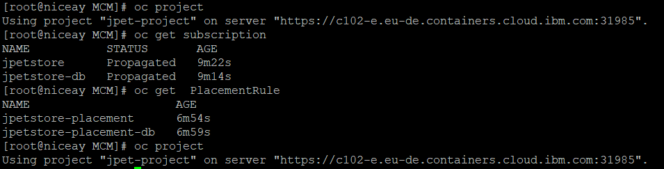
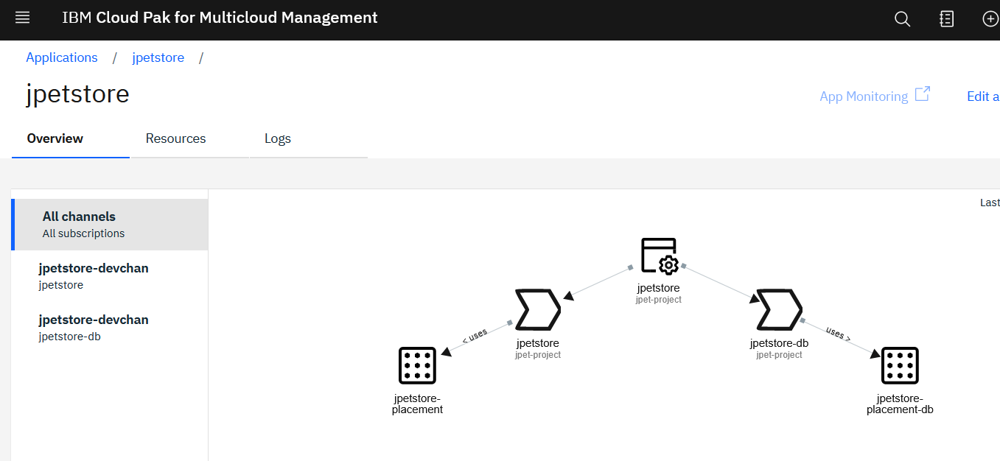
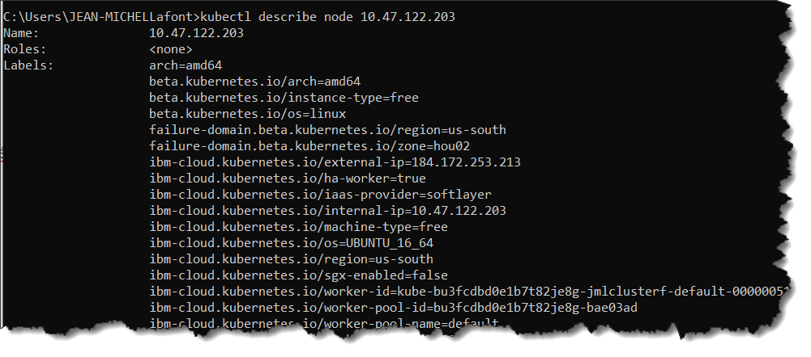

# Creation et deploiement de l'appli JPetStore depuis MCM

- creer les namespaces (jpet-definition,jpet-project ) sur le hub

- creeer les ressources:

```
/home/jpetstore/jpetstore-kubernetes/MCM
[root@niceay MCM]# oc apply -f deployable.yaml
deployable.app.ibm.com/jpetstore-deployment created
deployable.app.ibm.com/jpetstoredb-deployment created
deployable.app.ibm.com/jpetstore-service-np created
deployable.app.ibm.com/jpetstore-dbservice created
deployable.app.ibm.com/jpetstore-route created
```

```
[root@niceay MCM]# oc apply -f channel.yaml
channel.app.ibm.com/jpetstore-devchan created
```

```
[root@niceay MCM]# oc apply -f subscription-web.yaml
subscription.app.ibm.com/jpetstore created
[root@niceay MCM]# oc apply -f subscription-db.yaml
subscription.app.ibm.com/jpetstore-db created
```

```
[root@niceay MCM]# oc apply -f subscription-db.yaml
subscription.app.ibm.com/jpetstore-db configured
[root@niceay MCM]# oc apply -f subscription-web.yaml
subscription.app.ibm.com/jpetstore configured
```

```
[root@niceay MCM]# oc apply -f placementrule-db.yaml
placementrule.app.ibm.com/jpetstore-placement-db created
[root@niceay MCM]# oc apply -f placementrule-web.yaml
placementrule.app.ibm.com/jpetstore-placement created
```

```
[root@niceay MCM]# oc apply -f application.yaml
application.app.k8s.io/jpetstore created
```


Ces actions créent de CR sur le hub:


​	




L'appli devient visible depuis MCM




Puis, une fois le cluster labellé conformement aux placement rules et le namespace destination créé sur la cible, l'application et automatiquement déployée:


Pour tester:

- recuperer le port assigné au service,


- récupérer l'adresse externe d'un noeud du cluster cible





- construire l'URL 


