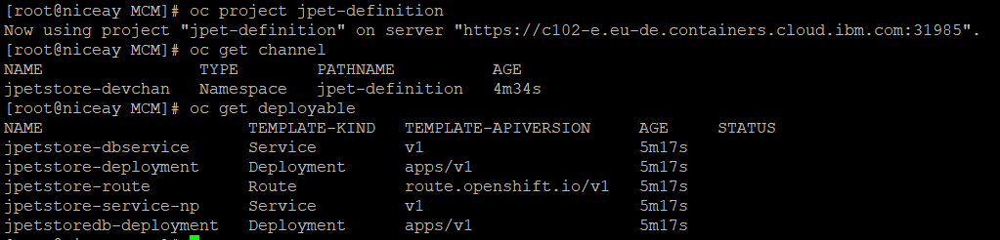
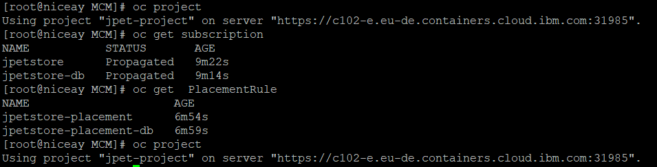
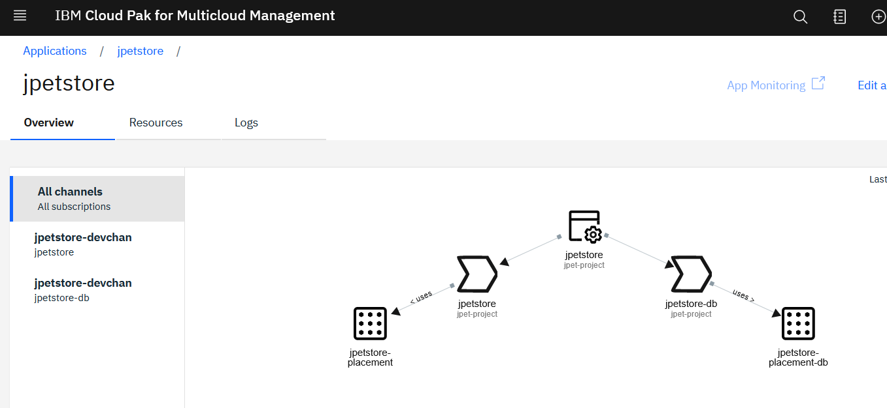
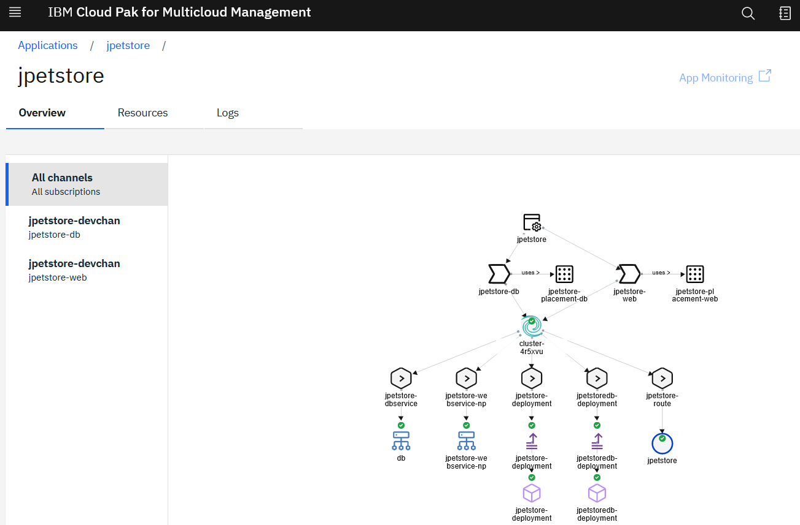
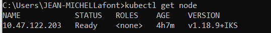
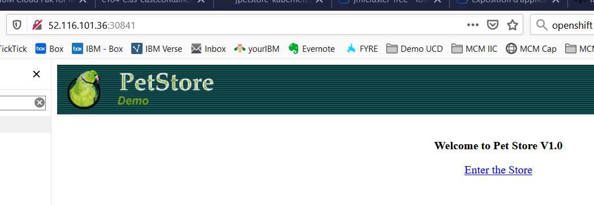

# Creation et deploiement de l'appli JPetStore depuis MCM

## Materiel:

- Deux images dockers (sous docker hub):
  - **jmlafont/jpetstoreweb** : front end tomcat
  - **jmlafont/jpetstoredb** :database

- Un ensemble de manifestes yaml

## Utilisation

- [ ] créer les namespaces sur le hub:

- jpet-definition	: contiendra la définition des deployables et channels

- jpet-project		: contiendra les définitions de l'application et ses souscriptions et placement rules

- [ ] créer le namespace cible jpet-mcm sur la cluster cible

- [ ] creeer les ressources:

```
# oc apply -f deployable.yaml
deployable.app.ibm.com/jpetstore-deployment created
deployable.app.ibm.com/jpetstoredb-deployment created
deployable.app.ibm.com/jpetstore-service-np created
deployable.app.ibm.com/jpetstore-dbservice created
deployable.app.ibm.com/jpetstore-route created
```

```
# oc apply -f channel.yaml
channel.app.ibm.com/jpetstore-devchan created
```

```
# oc apply -f subscription-web.yaml
subscription.app.ibm.com/jpetstore created
[root@niceay MCM]# oc apply -f subscription-db.yaml
subscription.app.ibm.com/jpetstore-db created
```

```
# oc apply -f subscription-db.yaml
subscription.app.ibm.com/jpetstore-db configured
# oc apply -f subscription-web.yaml
subscription.app.ibm.com/jpetstore configured
```

```
# oc apply -f placementrule-db.yaml
placementrule.app.ibm.com/jpetstore-placement-db created
[root@niceay MCM]# oc apply -f placementrule-web.yaml
placementrule.app.ibm.com/jpetstore-placement created
```

```
# oc apply -f application.yaml
application.app.k8s.io/jpetstore created
```


Ces actions créent des Custom Resources sur le hub:



​	




Une fois toutes les ressources créées, l'appli devient visible depuis MCM, mais n'est pas déployée tant qu'un cluster cible ne remplit pas les conditions de sélection




Puis, une fois le cluster labellé conformement aux placement rules , l'application est automatiquement déployée:




Pour tester (à l'aide du service de type Node Port):

- [ ] récupérer le port assigné au service,


- [ ] récupérer l'adresse externe d'un noeud du cluster cible




- [ ] construire l'URL et l'utiliser dans un navigateur



