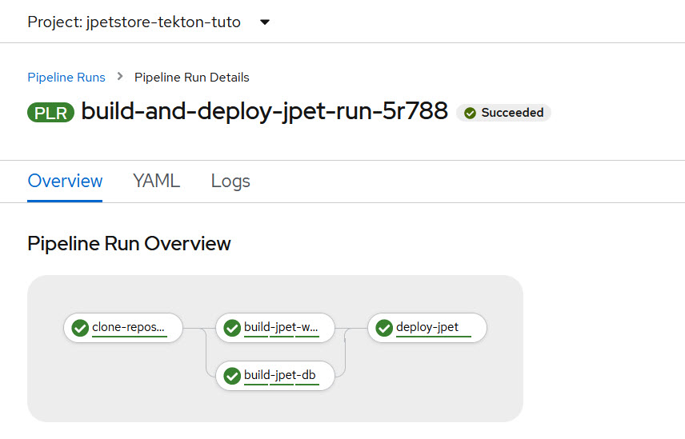
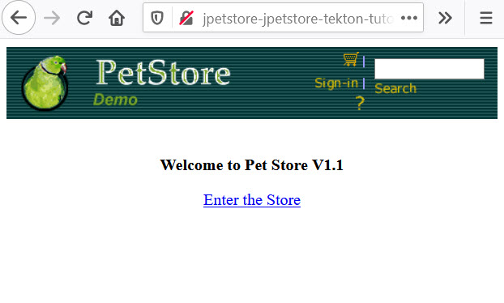

# Tekton CI/CD pipeline

## Introduction

In this workshop, you will build an application from its source files and deploy it to an OCP cluster using Openshift Pipeline.

Everything needed is in the current repository

- Source files are in the [../jpetstore](../jpetstore) subdirectory 
- yaml files to deploy the application are in [../YAML](../YAML) subdirectory
- pipeline definition is in [Pipeline.yaml](Pipeline.yaml) file in  [../Tekton](../Tekton) subdirectory

## Pre-requisites:

- a valid linux session
- git CLI installed
- oc CLI installed
- tkn CLI installed
- Openshift pipeline (tekton) Operator installed on an openshift cluster 
- two image repositories to store the images:
  - one to store the application server image 
  - second one to store the db server image 


## Workshop

clone the git repository on your linux session

```
git clone https://github.com/jmlafont/jpetstore-kubernetes.git
```

go into Tekton directory

```
cd jpetstore-kubernetes/Tekton
```

create a project:

```
oc new-project jpetstore-tekton-tuto
```

have a look on the pipeline definition in  [Pipeline.yaml](Pipeline.yaml) file

- This pipeline uses the predefined ClusterTask **git-clone** to clone the source repository and store it in a workspace.
- Then it uses the ClusterTask **buildah** which build the application war from sources and the database, packages the images, according to the Dockerfiles found in the git repository and pushes them in the image repository.
- The last task is a custom one that deploy the application to the OCP cluster using the yaml file found in the repository. This will create two deployments , two services and a route.

[optional] : edit the pipeline definition to change the default parameters values

create the pipeline and tasks

```
oc apply -f Pipeline.yaml
```

run the pipeline

```
tkn pipeline start build-and-deploy-jpet \
--workspace name=workspace,volumeClaimTemplateFile=pvc.yaml

```

Wait until the end of pipeline execution




find the route to connect to the application

```
#oc get routes
NAME        HOST/PORT                                                      PATH   SERVICES   PORT   TERMINATION   WILDCARD
jpetstore   jpetstore-jpetstore-tekton-tuto.apps.wonkier.os.fyre.ibm.com          web        9080                 None
```

Add it to your DNS or /etc/hosts file

Use a browser to view and use the application

